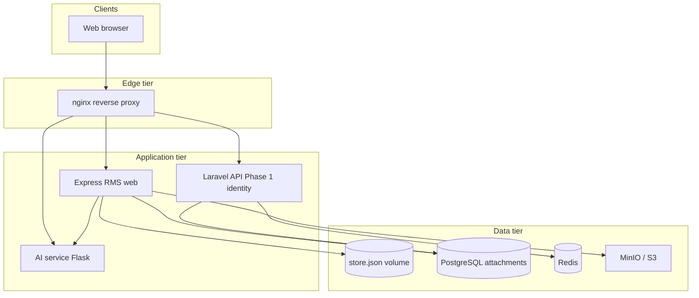

# System Architecture

## Overview

The AI Risk Management System (RMS) is an ISO **31000:2018**-aligned risk workflow with AI-assisted classification, multi-role ownership, and Docker-based deployment.

### Current implementation vs planned stack

| Layer | **Current (running)** | **Planned / target** |
|-------|----------------------|----------------------|
| Edge | nginx reverse proxy | Same |
| Application UI + workflow | **Express (Node 20)** in `docker/web` — sessions, tickets, RBAC | Next.js frontend (future) |
| API | Laravel 11 in `backend/` (Phase 1: identity + Sanctum tokens; no browser auth cutover) | Laravel 11 + Sanctum owns REST ([ADR 001](adr/001-backend-laravel.md)) |
| AI | Flask health/classify service | Expanded NLP pipeline |
| Persistence | `store.json` (tickets/users/org) + PostgreSQL (`risk_attachments`) + MinIO/S3 | Full relational model in PostgreSQL |
| Cache | Redis (compose) | Queues / cache for Laravel |

Documented “planned” API tables and Next.js UI remain the long-term target. Day-to-day behavior below matches the **Express web app**.

## Logical architecture (current)

## Roles and responsibilities

Canonical registry: [`docker/web/config/roles.js`](../docker/web/config/roles.js). Details and seed logins: [LOGIN.md](LOGIN.md).

| Role | Path | Responsibilities |
|------|------|------------------|
| Ticket Reporter (`supervisor`) | `/supervisor` | Create/edit drafts; require full 5W1H + evidence; submit; revise when returned; implement plans; submit accomplishments |
| Department Head / VP (`dept_head`) | `/dept` | Own department tickets: accept/reject/reassign; action plans; return for revision (after accept); close Low/Moderate after accomplishment; manage `/dept/returned` after President return |
| Risk Management Officer — RMO (`rm_officer`) | `/officer` | Governance oversight: register, SLA/overdue, monitoring, comments; reopen closed tickets. **Does not** own, edit mitigation as owner, or close |
| President (`president`) | `/president` | Approve / reject / return High & Critical action plans and final decisions |
| Executive Committee (`executive`) | `/executive` | View-only oversight (dashboard, heatmap, reports, trends); High/Critical notifications |
| System Administrator (`admin`) | `/admin` | Users (incl. employee IDs), departments, positions, ticket view/delete, audit logs, branding/settings. **No** workflow approve/close |
| Employee (`employee`) | `/dashboard` | Non-assignable stub |

**Removed from the active model:** Audit Officer console and RMO-as-ticket-owner workflow.

## Workflow summary

1. Reporter logs in and creates a risk report (**all 5W1H** + **≥1 evidence file**).
2. AI assists summarization/categorization; on submit the ticket is **assigned** to a department.
3. Department Head accepts ownership (or rejects/reassigns) and builds an **action plan**.
4. **Low/Moderate:** plan published to reporter for implementation. **High/Critical:** plan goes to the **President** first.
5. Reporter implements; submits an **accomplishment**.
6. Department closes Low/Moderate after accomplishment; High/Critical use **President final** decision.
7. RMO monitors compliance and may **reopen** closed tickets; Executive monitors High/Critical views continuously.

Historical swimlane art in [`RMS FLOWCHART.png`](../RMS%20FLOWCHART.png) may still show older Audit/RMO-ownership steps — prefer this document and [LOGIN.md](LOGIN.md) for current behavior.

### Notable rules

- **Ownership gate:** Department may return a report for revision only after accepting ownership.
- **Returned-ticket queue:** `/dept/returned` holds President-returned or rejected High/Critical work for plan/final revision.
- **Action-plan revision:** After President return, the department revises and republishes; reporter resubmit may require content change when status is `returned` / `ownership_rejected`.
- **Notifications:** Role- and department-scoped; President/Executive filtered to High/Critical.

## Ticket state machine

Statuses from [`docker/web/config/tickets.js`](../docker/web/config/tickets.js):

| Status | Description |
|--------|-------------|
| `draft` | Reporter composing |
| `submitted` | Submitted (brief AI / routing stage) |
| `assigned` | Routed to department inbox |
| `ownership_rejected` | Department rejected ownership — reporter revises |
| `in_progress` | Department accepted; planning / working |
| `pending_president` | High/Critical plan awaiting President |
| `pending_president_final` | High/Critical final awaiting President |
| `in_mitigation` | Implementation required (reporter) |
| `pending_audit` | Accomplishment submitted (awaiting closure path) |
| `resolved` | Resolved |
| `closed` | Complete |
| `reopened` | Reopened (e.g. by RMO) for further action |

**Legacy** (retained for historical tickets; not the active Audit loop): `under_review`, `returned`, `under_audit`, `audit_returned`.

Ticket references: `RISK-{YEAR}-{#####}` (e.g. `RISK-2026-00001`), assigned as max existing sequence for the year + 1.

## API surface (Phase 1 + planned)

Versioned REST under `/api/v1/` (Laravel). **Express still owns browser login and workflow HTTP.**

**Phase 1 (live on Laravel, not used by browser UI):**

- `GET /api/v1/health` — API health
- `POST /api/v1/auth/token` — Sanctum personal access token (username/password)
- `GET /api/v1/users/me` — current user (Bearer token)
- `php artisan rms:import-users` — import identity from `store.json` into Postgres

**Planned later:**

- Risk tickets CRUD and workflow transitions
- Attachments and evidence
- AI classify/summarize (proxied to `ai-service`)
- Dashboards and reporting

Today, workflow HTTP routes live on the **Express web** service; nginx proxies `/api/` to Laravel for the endpoints above. See [LARAVEL_MIGRATION.md](LARAVEL_MIGRATION.md).

## Data model

### Current

- **`docker/web/data/store.json`** — users, departments, positions, `riskTickets`, accomplishments, notifications, report/audit/credential logs, settings (**source of truth for live app**)
- **PostgreSQL `users`** — Laravel copy of identity (bcrypt passwords) for Sanctum tokens; optional import from store.json
- **PostgreSQL `risk_attachments`** — evidence metadata keyed by `ticket_ref`
- **MinIO/S3** — file bytes under `{ticketRef}/...`

### Planned (relational)

- `users`, `risk_tickets`, `mitigation_plans`, `accomplishment_reports`, `audit_logs`, `ai_analysis_results`

## Technology stack

| Layer | Current | Target |
|-------|---------|--------|
| Web / workflow | Node 20, Express, server-rendered HTML | React / Next.js UI |
| API | Laravel 11 Phase 1 (identity + Sanctum) | Laravel 11, Sanctum, PHP 8.3 |
| Database | PostgreSQL 16 (attachments + future API) | Same |
| Cache/queue | Redis 7 | Same |
| AI | Python 3.11, Flask | Expanded models |
| Edge | nginx 1.27 | Same |
| Files | MinIO (dev) / S3 (prod) | Same |

## Docker mapping

| Logical component | Container |
|-------------------|-----------|
| Reverse proxy | `nginx` (`rms-nginx`) |
| RMS web app | `web` (`rms-web`) |
| API | `api` (`rms-api`) |
| AI | `ai-service` |
| Database | `postgres` |
| Cache | `redis` |
| Object store | `minio` |

See [Docker Guide](DOCKER.md) and [Port Registry](PORT_REGISTRY.md).

## Security architecture

- TLS at nginx (production)
- **RBAC enforced in Express** (`docker/web/lib/auth.js`) for the live app; Laravel holds a mirror of roles/users for API tokens only (Phase 1)
- Secrets via Docker secrets files (not in git)
- Network segmentation: `rms_edge`, `rms_app`, `rms_data`
- nginx re-resolves Docker DNS for upstreams (avoids stale IP **502** after container recreate)

Details: [Container Security](CONTAINER_SECURITY.md).

## Operations hooks

- Ticket-only reset: `docker/web/scripts/reset-ticket-data.js` (preserves users/departments/positions)
- Broader production wipe: `docker/web/scripts/reset-production-data.js`

See [Operations](OPERATIONS.md).

## Alternate backend

Node.js 20 + Express remains an alternate for the **`api`** container in [ADR 001](adr/001-backend-laravel.md). The **web** container already runs Express for the current product UI and workflow.
